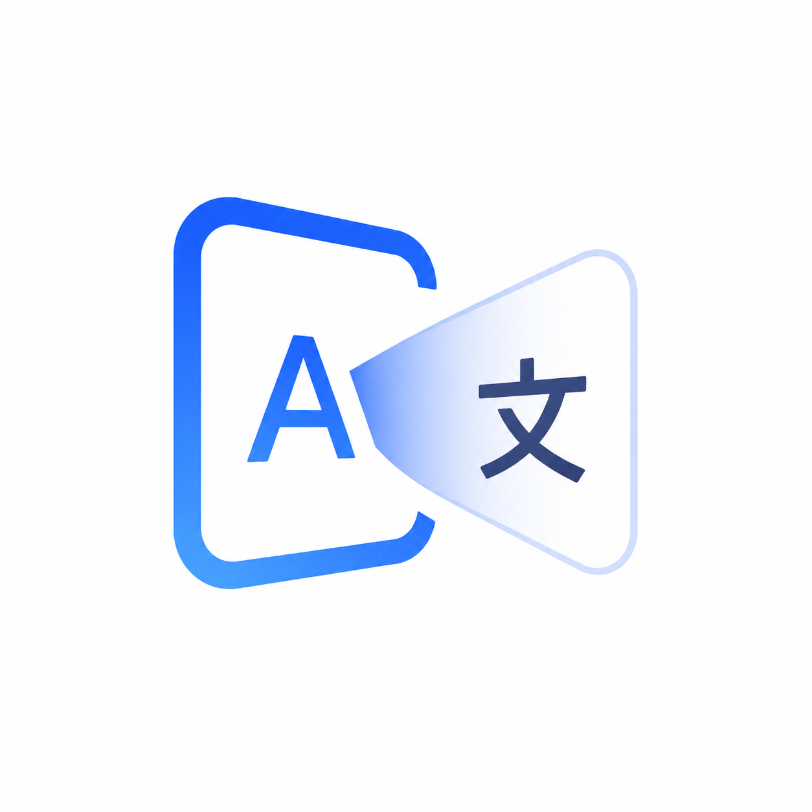

<div align="center">
  
  <h1>Screen Translator</h1>
  <p><b>God-Tier On-Device Manga/Comic Translator for Android</b></p>

  
  
  
  
  
</div>

<br>

Screen Translator is an advanced Android accessibility tool designed specifically for reading non-translated comics, mangas, and manhwas. It runs quietly in the background and automatically translates on-screen text when you stop interacting with the screen. 

No more manually cropping screenshots or switching apps! Just read, pause, and let the AI translate directly over your comic.

## Key Features

*   **Thin APK Architecture**: By leveraging Google Play Services, the initial app download size is drastically reduced. No language models are bundled -- download only what you need!
*   **Smart AI Download Manager**: Language models are downloaded on-demand in the background via Google Play Services. You only download the languages you read.
*   **Smart Auto-Detect**: The engine intelligently falls back through your *installed* OCR models without wasting battery or data on uninstalled languages.
*   **Material Design 3**: A gorgeous, modern UI featuring a seamless Light, Dark, and System theme switcher.
*   **Full Overlay Customization**: Control every aspect of the translation bubble:
    *   Placement mode (Direct overlay / Left / Right)
    *   Opacity (10% - 100%)
    *   Corner radius (0dp - 32dp)
    *   Text size (8sp - 28sp)
    *   Bubble color (White / Black / Yellow)
    *   Border toggle
    *   Auto-clear timer (Off / 1-30 seconds)
*   **Smart Inactivity Sensor**: Translates the screen automatically if you don't scroll or touch the screen for a specific duration (default: 3 seconds).
*   **Dynamic Bubble Overlay**: Translations feature rounded corners mapped directly over the original text bubbles.
*   **Draggable UI**: If a translation bubble covers a character's face, simply touch and drag it out of the way!
*   **100% On-Device & Offline**: Uses Google ML Kit's on-device models. Fast, private, and requires no internet connection once the models are downloaded.
*   **Splash Screen**: Beautiful animated splash screen on app launch.

## Technology Stack

*   **Language**: Kotlin
*   **Build System**: Gradle Kotlin DSL (`.kts`)
*   **UI Framework**: Material Design 3 (Material Components for Android)
*   **Screen Capture**: `MediaProjection` API (Foreground Service)
*   **User Tracking**: `AccessibilityService` (Monitors `TYPE_VIEW_SCROLLED`)
*   **AI Engine**: [Google ML Kit via Play Services](https://developers.google.com/ml-kit)
    *   Text Recognition (v2) for Japanese, Korean, Chinese, Devanagari, and Latin scripts.
    *   ModuleInstall API for on-demand model delivery.
    *   On-Device Translation.

## How to Install and Run

1.  Clone this repository:
    ```bash
    git clone https://github.com/ervareza/screen-translator.git
    cd screen-translator
    ```
2.  Open the project in **Android Studio** or **Google Antigravity IDE**.
3.  Let Gradle sync and download the required dependencies.
4.  Run `./gradlew assembleDebug` to build the APK.
5.  Install the APK on an Android device running Android 8+ (API 26+).

### Required Permissions
Upon first launch, the app will ask you to manually grant:
*   **Display over other apps** (`SYSTEM_ALERT_WINDOW`): Required to draw the translation bubbles over your comics.
*   **Accessibility Service**: Required to detect when you stop scrolling.
*   **Notification Permission** (Android 13+): Required to show the foreground service notification.
*   **Screen Recording** (`MediaProjection`): Required to capture the comic's image when translating.

## Contributing

We welcome all contributions! Whether it's adding support for new languages, optimizing the OCR bounding boxes, or improving the UI, your help is appreciated.

Please read our [CONTRIBUTING.md](CONTRIBUTING.md) for details on our code of conduct, and the process for submitting pull requests to us.

## License

This project is licensed under the MIT License - see the [LICENSE](LICENSE) file for details.
